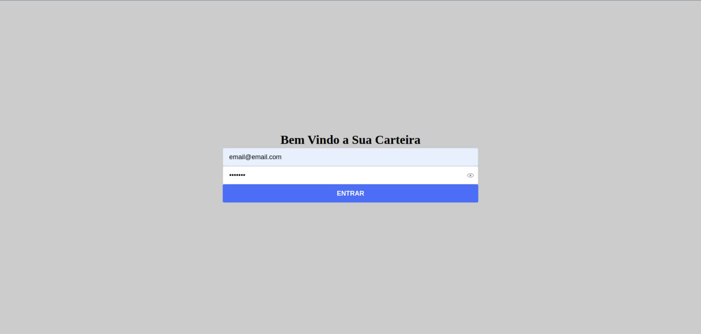
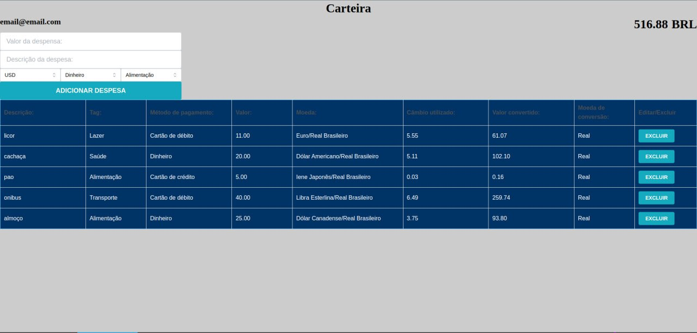

# Projeto de Câmbio de Moedas com React e Mantine

## Resumo do Projeto
Este projeto foi desenvolvido para realizar câmbio de várias moedas, somando a conversão e exibindo o valor em reais. O projeto foi implementado utilizando React para a interface de usuário e Mantine para componentes estilizados. A aplicação permite adicionar transações de câmbio, que podem ser removidas individualmente. Eu fui responsável por desenvolver todos os componentes, páginas, testes e a integração com o Redux. O projeto não foi inteiramente feito por mim; algumas partes foram desenvolvidas em colaboração com outros desenvolvedores.

## Descrição do Projeto
O projeto de câmbio de moedas é uma aplicação web que permite aos usuários converter valores de diferentes moedas para reais. A interface é construída com React e os componentes estilizados com Mantine. O projeto inclui uma lista de transações de câmbio que pode ser atualizada dinamicamente, com a opção de remover itens individualmente.

## Funcionalidades Implementadas
- Conversão de valores de várias moedas para reais
- Adição de transações de câmbio
- Remoção individual de transações
- Listagem de todas as transações adicionadas

## Testes Implementados
Todos os testes para garantir a funcionalidade correta da aplicação foram desenvolvidos por mim, incluindo:
- Testes unitários para os componentes
- Testes de integração para a aplicação
- Testes para verificar a interação com o Redux

## Integração com Redux
Fui responsável pela integração completa com o Redux, gerenciando o estado global da aplicação, incluindo:
- Ações para adicionar e remover transações
- Redutores para atualizar o estado da aplicação
- Configuração da store do Redux

## Link do Deploy
O projeto está disponível online e pode ser acessado através do seguinte link:
[https://bernardojfilho.github.io/carteira_cambio/](https://bernardojfilho.github.io/carteira_cambio/)

## Imagens do Projeto
Abaixo estão algumas imagens que demonstram como é o site:

